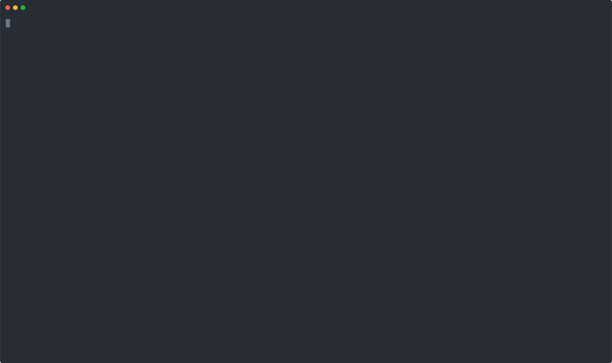

# Bloch — A Modern Open-Source Quantum Programming Language

Bloch is a modern, strongly typed, interpreted quantum programming language from [Bloch Labs](https://bloch-labs.com). Paired with our upcoming **Bloch Studio** web IDE and circuit builder, it aims to *unify the quantum development stack* by offering a clean, language‑first, and vendor‑agnostic workflow that scales from research experiments to production circuits. By open-sourcing the core language, we invite the community to help build a sustainable, hardware-agnostic foundation for tomorrow’s quantum applications.

## Demo

Prepare an entangled Bell state, then measure both qubits 8192 times using a tracked array to observe entangled outcomes; expecting roughly 50/50 results for 00 and 11.

## Docs
- [Official docs](https://docs.bloch-labs.com/bloch/overview)
- [Official VSCode extension](https://github.com/bloch-labs/bloch-vscode)

## Installation

Quick install (Linux/macOS):

```bash
curl -fsSL https://raw.githubusercontent.com/bloch-labs/bloch/HEAD/scripts/install.sh | bash -s -- latest
```

Notes:
- The script downloads the `bloch` binary for your OS/arch, verifies its checksum, and installs it. By default it installs to `~/.local/bin` (preferred), then `/usr/local/bin` if writable, otherwise `~/bin`.
- To install a different version, pass the tag (e.g., `v1.0.0`) or use `latest` (stable) / `latest-rc` (pre-release, requires `jq`).
- If your shell session doesn't pick up `~/.local/bin` automatically, the installer appends a PATH update to your shell profile and suggests reloading your shell (e.g., `exec $SHELL -l`). Opening a new terminal also works.
- To choose a custom install directory:

  ```bash
  INSTALL_DIR=$HOME/.local/bin curl -fsSL https://raw.githubusercontent.com/bloch-labs/bloch/HEAD/scripts/install.sh | bash -s -- latest
  ```

Manual install:
- Download the asset matching your platform from the release page and extract the tarball: `bloch-<TAG>-<OS>-<ARCH>.tar.gz`
- Move the `bloch` binary to a directory on your `PATH` (e.g., `/usr/local/bin`).

For instructions on how to build from source, see "Building Locally" in [CONTRIBUTING.md](CONTRIBUTING.md). You can also install locally via CMake after building:

```bash
cmake --install build --prefix ~/.local
```

To verify your installation:

```bash
bloch --version
```

## CI/CD & Release Automation
- Feature work branches from `develop` using the `type/issue-number` convention (e.g. `feat/142`).
- Every PR triggers PR Quality checks (formatting, build, unit tests, commit lint) plus CodeQL static analysis.
- Merges to `develop` wake the release-please bot, which maintains the changelog and raises a `chore: release X.Y.Z` PR.
- Merging that PR automatically creates `release-vX.Y.Z`, tags `vX.Y.Z-rc.1`, and runs the release-candidate workflow to build binaries and publish a prerelease.
- Release fixes target the release branch and run the same quality checks; a final PR into `master` runs release dry runs, and tagging `vX.Y.Z` publishes production artifacts via GitHub Releases.
- Use squash merges so each PR contributes a single Conventional Commit; Release Please now builds changelog entries from merged PR titles.

## Contributing
Bloch is an open-source project and we welcome contributions! Please see [CONTRIBUTING.md](CONTRIBUTING.md) for contribution guidelines and local build instructions.

## Community & Updates

- Website & blog: [bloch-labs.com](https://bloch-labs.com)
- X/Twitter: [@blochlabs](https://x.com/blochlabs) · [@bloch_akshay](https://x.com/bloch_akshay)
- Contact: [hello@bloch-labs.com](mailto:hello@bloch-labs.com)

## License
Bloch is licensed under the [Apache 2.0](https://www.apache.org/licenses/LICENSE-2.0) license.
