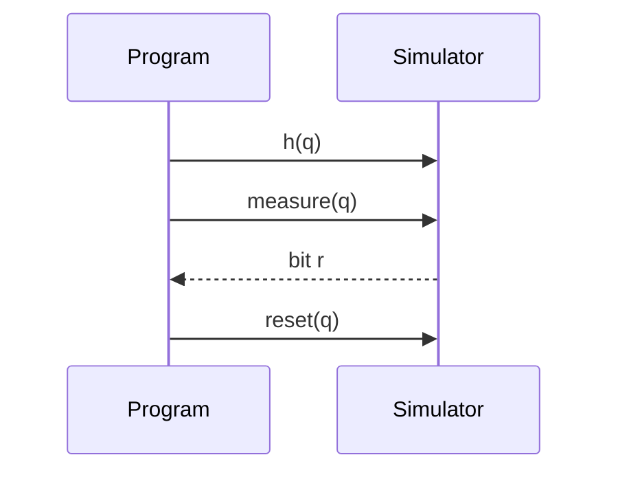

# Quantum Model

Bloch integrates quantum operations with classical control. Qubits are first-class values with dedicated built-ins and measurement/reset primitives.

## Qubits

```
qubit q;        // allocates a new simulated qubit
qubit[2] qreg;  // allocates a 2-qubit register
```

`qubit` values are opaque handles into the simulator state. Indexing a `qubit[]` array yields a `qubit` element.

## Measurement and reset

- `measure q;` (statement) collapses the state and records a classical outcome.
- `bit b = measure q;` (expression) returns the result as `0b` or `1b`.
- `reset q;` reinitialises a qubit to `|0>` and clears the last-measurement tracker.



## Built-in gates

These map directly to the simulator and to OpenQASM emission:

- Single-qubit: `h(q)`, `x(q)`, `y(q)`, `z(q)`
- Rotations: `rx(q, theta)`, `ry(q, theta)`, `rz(q, theta)` where `theta: float`
- Two-qubit: `cx(control, target)`

## @quantum functions

Mark functions that perform quantum work with `@quantum`. They must return `bit` or `void`.

```
@quantum
function bell(qubit a, qubit b) -> void {
  h(a); cx(a, b);
}
```

When a `@quantum` function returns a `bit`, the runtime also retains measurements in a per-call trace, useful for testing.

## @tracked statistics

`@tracked` on a `qubit`/`qubit[]` records outcomes at scope exit:

```
function main() -> void {
  @tracked qubit[2] q;
  h(q[0]); cx(q[0], q[1]);
  measure q[0]; measure q[1];
}
```

Run with `--shots=N` to aggregate an outcome table (e.g., `00`, `11`, `?`).

