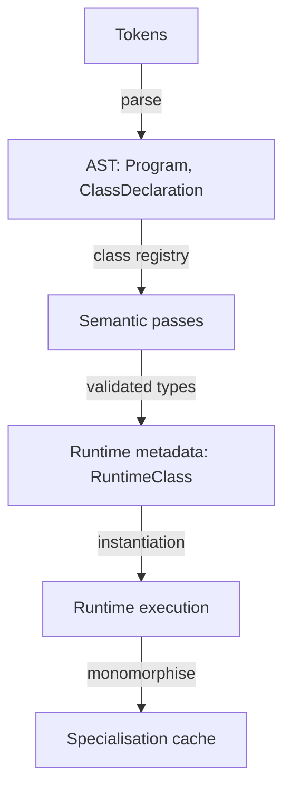

# DES-001: Class System Architecture (C++)

## Scope
ADR-001 (class system), ADR-002 (null handling), ADR-003 (generics)

## High Level Flow

<em>Figure: End-to-end class pipeline</em>

## Compilation (Lexer/Parser/AST)
- Files: `src/bloch/core/parser/parser.cpp`, `src/bloch/core/ast/ast.hpp`.
- `ClassDeclaration`: `typeParameters`, `baseType` (generic-aware), legacy `baseName`.
- `NamedType`: `nameParts`, `typeArguments`.
- Flow: modifiers → name → optional `<...>` → optional `extends` (`parseType`) → body members.
- Helpers: `isTypeAhead` disambiguates tokens with `<...>`; type/expr cloners preserve type arguments.

## Semantic Analysis
- Files: `src/bloch/core/semantics/semantic_analyser.{hpp,cpp}`.
- Core structs: `TypeInfo { value, className, typeArgs, isTypeParam }`, `ClassInfo { name, base, typeParams, fields, methods, constructors, abstractMethods, ... }`.
- Registry: collect classes, record type params/bounds, build signatures, enforce ctor presence, static-class restrictions.
- Type resolution: `typeFromAst`, `validateTypeApplication`, substitution helpers (`substituteTypeParams`, `substituteMany`).
- Inheritance/overrides: single inheritance; `override` must match a virtual base; static cannot be virtual/override; abstract if bodyless virtual methods.
- Null rules: only class refs nullable; null only in `==/!=`; member access on null rejected.
- Generics: class-level only; bounds enforced; `extends Base<T>` validated.
- Overloading: per-name buckets; duplicate signatures rejected; resolution via `findMethodInHierarchy` + `paramsMatchCall`; each overload forms its own virtual slot.

## Runtime Architecture
- Files: `src/bloch/runtime/runtime_evaluator.{hpp,cpp}`.
- Data: `RuntimeClass` (layout, vtable, methods, ctors, typeArgs), `RuntimeTypeInfo` (kind, className, typeArgs).
- Build: non-generic classes materialised eagerly; generic templates stored in `m_genericTemplates`; base layout/vtable copied before derived members.
- Monomorphization: `instantiateGeneric` clones template, substitutes type params (including base), builds layout/vtable, caches by `typeKey`, runs static initialisers.
- Dispatch: single vtable per class; overrides replace entries; overloads stored separately; runtime lookup matches parameter kinds.
- Null handling: null has `objectValue == nullptr`; member access throws `"null reference"`; `destroy null` is a no-op.

## Testing
- Parser/semantics/runtime/integration suites cover: generics, overrides, ctor rules, null rules, overload dispatch, runtime specialisation caching.

## Compatability
- Single inheritance only; generics are class-level; primitives/arrays non-nullable; static classes disallow instance members. Interfaces/method generics would require parser/semantic/runtime extensions.
