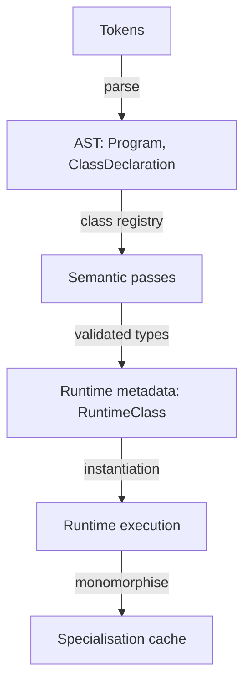

# DES-001: Class System Architecture (C++)

## Scope
* ADR-001
* ADR-002
* ADR-003
* ADR-009

## Design Goals
- Keep Bloch OO behaviour predictable for the v2.0.0 execution model.
- Preserve a strict single-inheritance tree rooted at `Object`.
- Keep generic surface intentionally small and explicit.
- Make stdlib `bloch.lang.Object` available out-of-the-box after install.

## Included vs Excluded
### Included
- Single inheritance.
- Root `Object` for all non-static classes.
- Virtual dispatch (`virtual` + `override`).
- Class-level generics with optional upper bounds.
- Visibility modifiers (`public`, `protected`, `private`).

### Excluded
- Multiple inheritance.
- Interfaces/traits.
- Method-level generics.
- Wildcard generics (`?`, `? extends`, `? super`).
- Raw types and method-argument-driven generic inference.

## High-Level Flow
<div align="center">



<em>Figure: End-to-end class pipeline</em>

</div>

## Object Root Model
```bloch
class Animal { public constructor() -> Animal = default; }
class Dog extends Animal { public constructor() -> Dog { super(); return this; } }
class Cat extends Animal { public constructor() -> Cat { super(); return this; } }
```

Semantic desugaring target:
- `Animal` becomes `Animal extends Object`.
- Every non-static class must declare at least one constructor.
- `Dog` and `Cat` remain direct subclasses of `Animal`.

Required runtime consequence:
- Constructor chains always terminate at `Object`.
- Every class reference is assignable to `Object`.

## Compilation (Lexer/Parser/AST)
- Files: `src/bloch/compiler/parser/parser.{hpp,cpp}`, `src/bloch/compiler/ast/ast.hpp`.
- `ClassDeclaration`: `typeParameters`, `baseType` (generic-aware), legacy `baseName`.
- `NamedType`: `nameParts`, `typeArguments`.
- Flow: modifiers → name → optional `<...>` → optional `extends` (`parseType`) → body members.
- Parser correctly enforces one `extends` clause (single inheritance).
- Generic grammar intentionally excludes wildcard tokens.

## Semantic Analysis
- Files: `src/bloch/compiler/semantics/semantic_analyser.{hpp,cpp}`.
- Core structs:
  - `TypeInfo { value, className, typeArgs, isTypeParam }`
  - `ClassInfo { name, base, typeParams, fields, methods, constructors, abstractMethods, ... }`
- Registry responsibilities:
  - Collect classes and bounds.
  - Validate single-inheritance chains and override legality.
  - Enforce static-context and final-field rules.
- Type resolution: `typeFromAst`, `validateTypeApplication`, substitution helpers (`substituteTypeParams`, `substituteMany`).
- Inheritance/overrides target:
  - Omitted `extends` maps to `Object`.
  - `override` must match virtual base signature.
  - Static methods cannot be `virtual`/`override`.
  - Bodyless `virtual` makes class abstract.
- Constructor target:
  - `super(...)` must be first when present.
  - Omitted `super(...)` requires an accessible zero-arg base constructor.
- Generics target:
  - Diamond inference for `new T<>()` is applied only when target type is known.
  - No raw types or wildcard syntax.
- Null rules: only class refs nullable; null only in `==/!=`; member access on null rejected.
- Generics: class-level only; bounds enforced; no wildcard support by design.
- Overloading: per-name buckets; duplicate signatures rejected; resolution via
  assignability-based cost selection (`findMethodInHierarchy` + conversion-cost matching)
  so the most specific applicable overload is selected.

## Runtime Architecture
- Files: `src/bloch/runtime/runtime_evaluator.{hpp,cpp}`.
- Data:
  - `RuntimeClass` (layout, vtable, methods, constructors, type args)
  - `RuntimeTypeInfo` (kind, className, typeArgs)
- Build:
  - Non-generic classes materialised eagerly.
  - Generic templates stored and instantiated lazily.
  - Base layout/vtable copied before derived members.
- Monomorphisation:
  - `instantiateGeneric` substitutes type parameters (including base type args).
  - Concrete specialisations cached by a stable key.
- Dispatch:
  - One vtable chain per class hierarchy.
  - Overrides replace inherited slots.
  - Overloads remain in per-name buckets.
- Null handling: null has `objectValue == nullptr`; member access throws `"null reference"`; `destroy null` is a no-op.

## Object Class + Stdlib Implementation
### Source Layout (repo)
- `library/bloch/lang/Object.bloch`
- Package declaration inside file: `package bloch.lang;`
- `bloch.lang` is a reserved stdlib package.

### Minimum Object API
- `public constructor() -> Object = default;`
- `public virtual function equals(Object other) -> boolean` (default: reference equality)
- `public virtual function toString() -> string`

### Installation Layout (user machine)
- Linux/XDG default: `~/.local/share/bloch/library/<bloch-version>/`
- macOS default: `~/Library/Application Support/Bloch/library/<bloch-version>/`
- Windows default: `%LOCALAPPDATA%\\Bloch\\library\\<bloch-version>\\`
- Environment override for tooling/CI: `BLOCH_STDLIB_PATH`

Note:
- Use `.local/share` (XDG), not `.local/shared`.

### Resolution Requirements
- After Bloch installation, stdlib must work without extra flags.
- Loader behaviour:
  - Default imports: importing file directory → configured search paths → current working directory.
  - `bloch.*` imports (including implicit `bloch.lang.Object` bootstrap): configured
    search paths first, then importing directory/current working directory.
- CLI provides stdlib search paths by default from:
  - User data directories (`~/.local/share/bloch/library`, platform equivalents),
  - Versioned stdlib subdirectories,
  - The executable-adjacent install tree (`../share/bloch/library`),
  - `BLOCH_STDLIB_PATH` override.
- Result: `bloch.lang.*` resolves to installed stdlib by default and project-local
  shadowing is prevented in the standard CLI path.

## Edge Cases That Must Be Covered
- Inheritance cycle detection (`A extends B`, `B extends A`).
- `super(...)` usage restricted to first constructor statement.
- Implicit `super()` must resolve to a unique, accessible zero-arg base constructor.
- `super`/`this` forbidden in static context.
- Override mismatch errors: missing base, non-virtual base, signature drift.
- Generic bound enforcement across inheritance chains.
- No wildcard generics accepted anywhere in parser or semantic passes.
- Root behaviour:
  - `class Animal { public constructor() -> Animal = default; }` is valid and inherits `Object`.
  - `extends Object` is valid and equivalent to omission.
  - `super()` from direct `Object` subclasses is legal and no-op beyond `Object` ctor.

## Testing Requirements
- Parser tests for no-wildcard generic rejection.
- Semantic tests:
  - `class Animal { public constructor() -> Animal = default; }` accepted.
  - `class A extends Object { public constructor() -> A { super(); return this; } }` accepted without user-defined `Object`.
  - `Animal a = new Dog();` accepted.
- Runtime tests:
  - `Dog`/`Cat` hierarchy dispatch still works under implicit `Object`.
  - Constructor chain ends at `Object`.
  - `bloch.lang.Object` resolves from installed stdlib without manual flags.

## Compatibility
- Single inheritance remains the only inheritance model.
- Generics remain class-level and intentionally non-variant.
- Interfaces and method generics remain future work.
